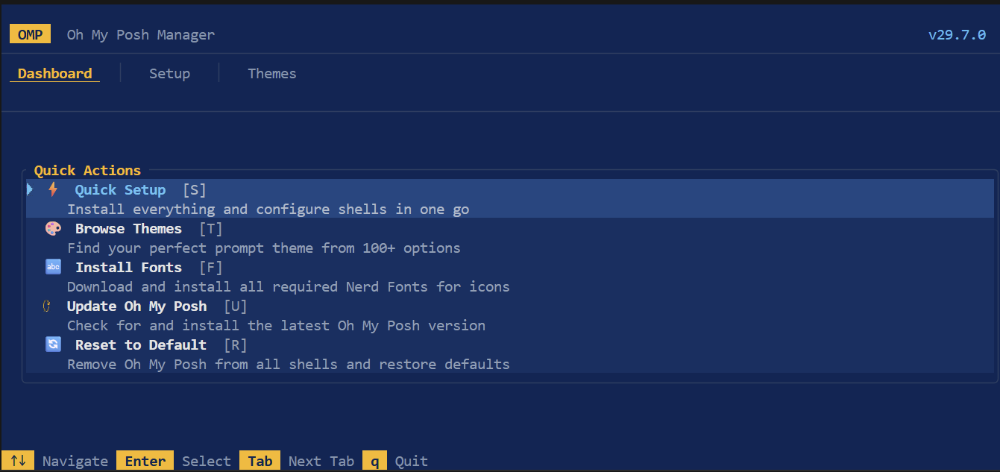

# Oh My Posh Manager

A terminal UI (TUI) that sets up **[Oh My Posh](https://ohmyposh.dev)** from scratch - no prior knowledge needed.

> **You don't need Oh My Posh installed.** The app detects what's missing and walks you through everything: installing Oh My Posh, picking a Nerd Font, previewing and applying a theme, and configuring your shell. Just run it and follow the wizard.

Built with **Rust**, **Ratatui**, and a PowerShell-blue color scheme.



---

## Installation

### Cargo (all platforms)

```sh
cargo install omp-manager
```

### WinGet (Windows)

```sh
winget install marlocarlo.OmpManager
```

### Chocolatey (Windows)

```sh
choco install omp-manager
```

### Scoop (Windows)

```powershell
scoop bucket add omp-manager https://github.com/marlocarlo/scoop-omp-manager
scoop install omp-manager
```

### Manual (all platforms)

Download the pre-built binary for your platform from the [latest release](https://github.com/marlocarlo/omp-manager/releases/latest), extract, and put `omp-manager` (or `omp-manager.exe`) anywhere on your `PATH`.

| Platform | Archive |
|----------|---------|
| Windows x64 | `omp-manager-vX.Y.Z-windows-x64.zip` |
| Windows x86 | `omp-manager-vX.Y.Z-windows-x86.zip` |
| Windows ARM64 | `omp-manager-vX.Y.Z-windows-arm64.zip` |
| Linux x64 | `omp-manager-vX.Y.Z-linux-x64.tar.gz` |
| Linux ARM64 | `omp-manager-vX.Y.Z-linux-arm64.tar.gz` |
| macOS Intel | `omp-manager-vX.Y.Z-macos-x64.tar.gz` |
| macOS Apple Silicon | `omp-manager-vX.Y.Z-macos-arm64.tar.gz` |

> **Windows note:** All Windows binaries are statically compiled — no VC runtime DLLs required.

### Build from source

```sh
git clone https://github.com/marlocarlo/omp-manager.git
cd omp-manager
cargo install --path .
```

Then run:

```sh
omp-manager
```

### 2. Follow the Setup Wizard

When you launch the app, go to **Quick Setup** (first item on the Dashboard) and press **Enter** at each step:

| Step | What happens |
|------|-------------|
| **1. Install Oh My Posh** | Downloads and installs the OMP binary (winget on Windows, brew on macOS, official script on Linux) |
| **2. Install a Nerd Font** | Presents a curated list of Nerd Fonts - pick one, press Enter, done |
| **3. Pick a Theme** | Quick-pick from popular themes, or go to the Themes tab to browse all 100+ with live preview |
| **4. Configure Shells** | Auto-detects your installed shells, toggle which ones to configure, press Enter |

After step 4, **restart your terminal** and your prompt is ready.

---

## Features

### Dashboard
System status at a glance - OMP version, active theme, Nerd Font status, shell config status. Quick actions: open Setup Wizard, jump to Themes, install fonts, update, or reset everything to default.

### Themes Browser
Browse **100+ built-in themes** with:
- **Category sidebar** - Popular, Minimal, Powerline, Colorful, Dark, Light
- **Live search** - press `/` and type to filter
- **Visual preview** - see colored PowerLine segments, blocks, and colors rendered in your terminal before applying
- **One-key apply** - press `Enter` to download (if needed) and apply any theme

Themes are auto-downloaded from the official Oh My Posh GitHub repo on demand. No manual file management needed.

---

## Keybindings

| Key | Action |
|-----|--------|
| `Tab` / `1-3` | Switch tabs |
| `↑` `↓` | Navigate lists |
| `←` `→` | Switch panels / categories |
| `/` | Search themes |
| `Enter` | Execute / Apply |
| `Space` | Toggle (setup shells) |
| `R` | Reset to default (dashboard) |
| `q` | Quit |

**Mouse is fully supported** - click tabs, click list items, scroll with the wheel, right-click themes for options.

---

## Supported Shells

The app auto-detects which of these are installed and lets you configure any combination:

| Shell | Config File |
|-------|-------------|
| PowerShell 7+ | `$PROFILE` |
| Windows PowerShell | `~/Documents/WindowsPowerShell/...profile.ps1` |
| Bash | `~/.bashrc` |
| Zsh | `~/.zshrc` |
| Fish | `~/.config/fish/config.fish` |
| Nushell | `~/.config/nushell/config.nu` |
| Cmd (Clink) | `~/.config/clink/oh-my-posh.lua` |
| Elvish | `~/.config/elvish/rc.elv` |

---

## How It Works (under the hood)

1. **Detection** - On startup, scans for the `oh-my-posh` binary, checks `POSH_THEMES_PATH`, detects installed shells and Nerd Fonts
2. **Theme catalog** - Merges a built-in catalog of 100+ themes with any `.omp.json` files found on disk
3. **Downloads** - Themes are fetched on demand from `https://raw.githubusercontent.com/JanDeDobbeleer/oh-my-posh/main/themes/`
4. **Shell config** - Writes the standard OMP init line to each shell's profile file (and can cleanly remove it)

---

## Project Structure

```
src/
├── main.rs       Entry point, event loop, input handlers
├── app.rs        Central state machine (App struct, Tab/Focus enums)
├── ui.rs         All ratatui rendering - tabs, body, overlays, footer
├── theme.rs      PowerShell-inspired color palette constants
├── detect.rs     OS, Oh My Posh binary, Nerd Font detection
├── install.rs    Platform-specific OMP install, shell configuration
├── themes.rs     100+ built-in theme catalog, discovery from disk
├── config.rs     OMP JSON config parsing (Block, Segment, etc.)
├── segments.rs   70+ segment type catalog with icons/examples
├── fonts.rs      18 Nerd Font catalog, install via `oh-my-posh font`
├── shell.rs      Shell profile paths, init command generation
└── preview.rs    Theme preview renderer (colored PowerLine segments)
```

## Requirements

- **Rust 1.70+** (for building from source)
- A terminal with 256-color or truecolor support (Windows Terminal, iTerm2, most modern terminals)

> You do **not** need Oh My Posh or a Nerd Font pre-installed - the app installs both for you.

## License

MIT
